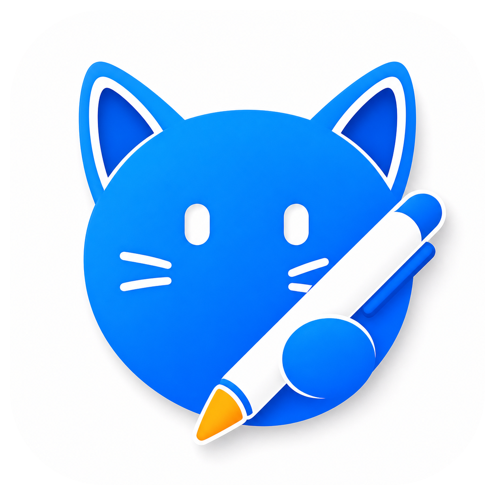

# Nibiko

<p align="center">
  
</p>

Nibiko is a small macOS menu bar app for quick notes, todos, reminders, focus sessions, and calendar-aware planning.

The app lives in the menu bar, keeps notes in a local Markdown vault, and provides a quick-add panel for capturing work without opening a full window.

## Features

- Menu bar status item with active task count and Pomodoro status.
- Quick-add panel for notes, todos, and reminders.
- Local Markdown storage in a user-selected vault.
- Apple Reminders integration for reminder-backed tasks.
- Calendar card for upcoming events.
- Pomodoro timer with configurable templates.
- Appearance, card visibility, card order, storage, and launch-at-login settings.
- Localized pilot UI strings.

## Requirements

- macOS 14 or newer.
- Xcode command line tools.
- Swift 6 toolchain.

## Build

```bash
swift build
```

## Test

```bash
swift test
```

## Run Locally

Use the project run script. It stops a running app instance, builds the app bundle, copies packaging resources, and launches the app.

```bash
./script/build_and_run.sh
```

Run with process verification:

```bash
./script/build_and_run.sh --verify
```

## Package a DMG

Download the latest public DMG from GitHub Releases:

<https://github.com/plexideas/nibiko/releases/latest>

Build a release app bundle and DMG:

```bash
scripts/package_app.sh
```

The script writes artifacts to `dist/`:

- `dist/Nibiko-0.1.0.dmg`
- `dist/Nibiko-0.1.0.dmg.sha256`

It also validates the app and image:

- `codesign --verify --strict`
- `hdiutil verify`
- read-only DMG mount check

## Share the DMG

For direct sharing, send the DMG file from `dist/`.

Because this build is ad-hoc signed, it is not notarized by Apple. Recipients may need to open it manually:

1. Download `Nibiko-0.1.0.dmg`.
2. Open the DMG.
3. Drag `Nibiko.app` into `/Applications`.
4. If macOS blocks launch, right-click `Nibiko.app`, choose `Open`, then confirm.

For a smoother public distribution flow, sign with a Developer ID certificate and notarize the DMG with Apple.

## Signing

By default, packaging uses ad-hoc signing:

```bash
scripts/package_app.sh
```

To package with a Developer ID identity:

```bash
CODESIGN_IDENTITY="Developer ID Application: Your Name (TEAMID)" scripts/package_app.sh
```

When a Developer ID identity is used, the packaging script enables hardened runtime and timestamping.

## Storage Compatibility

Nibiko keeps compatibility with legacy MenuBarNotes storage:

- existing `menuBarNotes.settings.v1` UserDefaults can still be read;
- existing `MenuBarNotes.md` vault files can still be migrated;
- legacy `menuBarNotesRecord` Markdown front matter remains readable.
